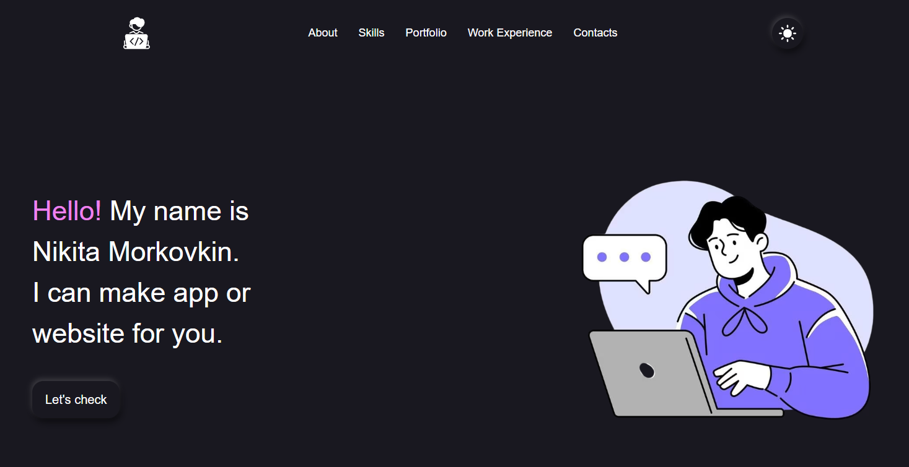

<h1><a href="">🫠Morkovkin Portfolio Website😎</a></h1>
<br>
<br>
<p align="center">
    
</p>
<br>
<br>
Это веб-сайт портфолио для демонстрации моих навыков.
<br>
На сайте можно узнать о моем опыте работы, моих навыках и мои контакты. Проект имеет адаптивную верстку. Также реализована смена темы, данные которой хранятся в Local Storage.
<br>
<br>
На моем сайте есть список моих изученных технологий в виде списка иконок, однако если для вас они непонятные, вот их список в виде текста (по порядку, слева направо):
<br>
<br>

**Раздел про фронтенд**:
    HTML5,
    CSS3,
    JavaScript,
    Figma,
    SCSS (Sass),
    Vite,
    Webpack,
    Node.js,
    React,
    Redux Toolkit,
    Zustand,
    TypeScript,
    React Query,
    Axios,
    React Router,
    React Hook Form,
    Vitest,
    React Testing Library,
    Cypress,
    Storybook,
    Tailwind CSS,
    Prettier,
    ESLint,
    Framer Motion,
    Next.JS,
    Docker,
    Material UI,
    Ant Design,
    MobX
<br>
<br>

**Раздел про геймдев**:
    C#,
    Unity Engine,
    Blender,
    Adobe Illustrator

<br>

### ⚒️ Стек технологий


<br>

### ⚙️ Установка и локальный запуск

Для работы с проектом убедитесь, что у вас установлен [Node.js](https://nodejs.org/ru/) (v16 или выше).

1.  **Клонируйте репозиторий:**
    ```bash
    git clone  https://github.com/nikita-morkovkin/morkovkin
    ```

2.  **Установите зависимости:**
    Эта команда скачает все необходимые пакеты, включая Vite, React и SCSS.
    ```bash
    npm install
    ```

3.  **Запустите сервер для разработки:**
    Эта команда запустит локальный сервер. Сайт будет доступен по адресу, который появится в терминале.
    ```bash
    npm run dev
    ```

---
